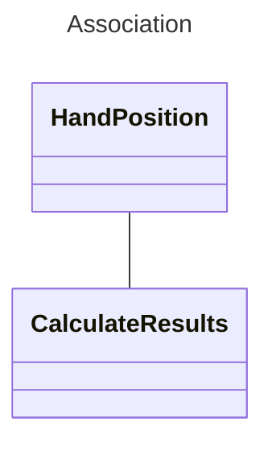

# Object Oriented Programming Concepts
*Jose Luis Lara Rubio*

## Diferences between class and Object

#### Class: Defines a template with specific characteristics and/or behaviours
#### Object: Represents a concrete entity which exists in memory during the execution of the program

CLASS | OBJECT
:-------------: | :-------------:
Exists in the project's design process and is part of the code structure | Exists in memory during runtime
Defines a blueprint which represents an object | Is defined by the contents of a class
Can be used to create multiple objects | Represents a specific entity

## Diferences between class and interface
#### Interface: Definition of a set of behaviours which a class must implement

CLASS | INTERFACE
:-------------: | :-------------:
Defines a complete object | Only defines a set of behaviours an object has
Can be used to create objects directly | Can not be used to create objects directly
Can have implemented methods | Can only have method definitions

## Polymorphism
Polymorphisim is the ability for multiple classes to be able to execute different instructions in their implementation of the same method

### Example
In our project we are using an interface IDisplayable which declares a method "Bitmap Display(Int x, Int y)". This way we can have different objects that can be displayed indiferently from one another but treat their conversion into a Bitmap form individually, this is very usefull when displaying information from the camera capture which has to be converted into a data type our UI framework can understand

## Association in a class diagram 
Association means two classes have a relationship with one another

### Example
In our project we have a class called DisplayResults, which uses a HandPosition object to determine the sign currently being shown by the user. Since CalculateResults uses HandPosition this means there is an associaton between them

## Differences between composition and aggregation
Composition and agregation are two different types of association.

Composition implies dependency from the child class to the parent class, where the child class only exists during its parent's lifetime. 

Aggregation on the other side means the child class is a part of the parent class but it can exist separately of it

###### *Note: Composition and aggregation do not imply inheritance, child and parent object are used to refer to the class which represent a part of something and the class which represents the whole thing respectively*

COMPOSITION | AGGREGATION
:-------------: | :-------------:
Implies owneship | Doesn't imply ownership
Child classes cannot be indivisually accesible | Child classes can be individually accesible
Child classes only exist during its parent's lifetime | Child classes can exist separately from their parent classes 

### Example
###### Just an example, not actually true
- Composition: 
The Hand class from our project contains a private array of Finger objects which are created inside the Hand object when it is instantiated and are destroyed when the hand is destroyed. 
- Agregation: 
The HandDetector class uses an instance of a Camera object to be able to detect the user's hand. Said Camera object is created before the instantiation of the HandDetector and is also accesed by the ImageConverter class which is in charge of turning the camera stream into a different format for later use.

## Encapsulation 
Encapsulation is the process of bundling private data inside publicly accessible methods which define the way said data can be interacted with

This represents the advantage of having full controll over what other classes are able to do with the information inside a class

### Example
The simplest example of encaptulation in our project and one that is very common in OOP are the getters and setters used in our Sign class which allow other classes to interact with the data inside of it but in a way that is limited by these methods

## Modularity 
Modularity is one of the base principles of object oriented programming. It means having multiple individual pieces that are only in charge of a single general task which might be composed of a bunch of smaller related tasks

The way it's represented in object oriented programming is by having separate classes which serve a general function composed of methods that compose the parts of said function

### Example
There are tons of examples of modularity in our project,a simple example of it is that, to be able to display the sign detected by the AI model a CalculateResults class has to interpret the position of the user's hand which is then sent to a separate class called DisplayResults that draws the UI representing the model's interpretation of the hand's position

## Diferences between interfaces and inheritance

Considering polymorphism, the biggest diference between interfaces and inheritance is the every class which uses an interface has to individually implement the defined methods, using the correct arguments and return types

This means calling the same method from different objects will execute a unique set of instuctions from each one where inheritance usually has a defeault implementation 

There is also a big conceptual difference. Inheriting from a class means the subclass is a "type of" the superclass, where implementing an interface only means the class will have a set of behaviours with  predetermined input and output types

CONCEPT | ADVANTAGES | DISADVANTAGES
:-------------|:------------- | :-------------
INHERITANCE | - Promotes code reutilization   - Can provide method definitions and implementations   - Can define private attributes for the subclass| - Can inherit unnecesary or unwanted behaviour   - Can't inherit from multile classes (In most languages)   - Makes subclasses extremely reliant on their superclasses
INTERFACES | - Allows for more code flexibility   - Allows unrelated classes to share common behaviours   - Classes can implement multiple interfaces | - Each class implements their own functionality which makes it prone to errors   - Doesn't promote code reutilization   - Updating the interface means you have to update all the classes which implement it
 